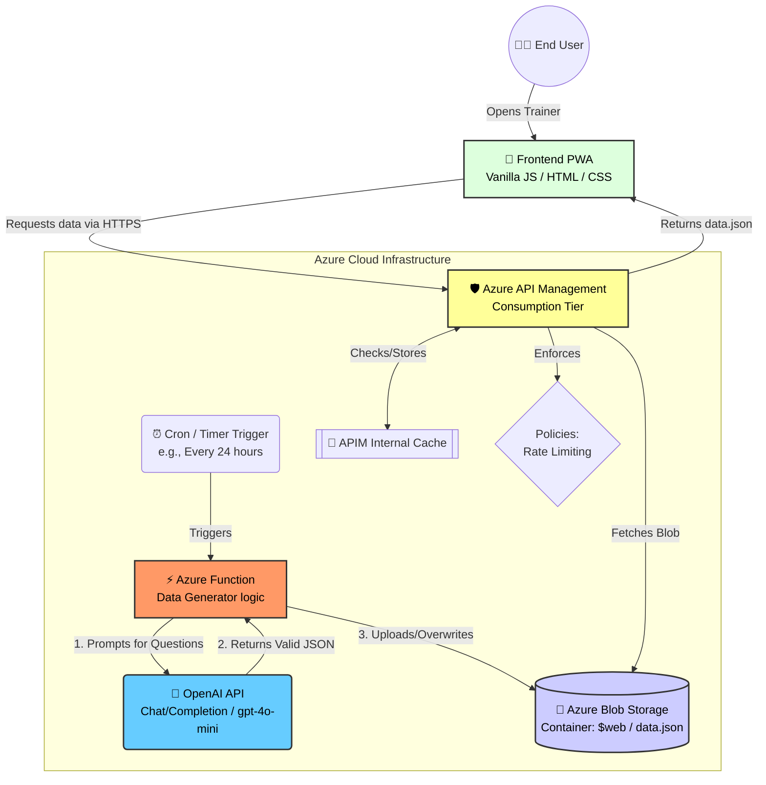

# Trener Polskiego 🇵🇱


A free, open-source Progressive Web App for practising Polish grammar on the way to the **B1 exam**. No account, no install required — open it in a browser and start drilling.

**Live → [przypadki.com](https://www.przypadki.com)**


---

## Screenshots

| Przypadki | bym / byś / by |
|---|---|
|  |  |

| Czas przeszły – ą/ę | Czas przyszły – dokonany |
|---|---|
|  |  |

## What it covers

| Module | What you practise |
|---|---|
| **Przypadki** | The 6 noun cases — nominative, genitive, dative, accusative, instrumental, locative |
| **bym / byś / by** | Conditional mood — verb conjugation and connector usage |
| **Czas przeszły** | Past tense — masculine/feminine endings, **e→a** verbs (widzieć, musieć, umieć), **ą→ę** verbs (wziąć, zamknąć, zacząć) |
| **Czas przyszły** | Future tense — picking the right form for **dokonany** vs **niedokonany** verbs |

Each module has two interaction modes:

- **Wybór** — pick the correct form from four options
- **Wpisanie** — type the answer yourself

Stats (success rate, correct, errors) are tracked live within the session.

## Contributing

Everyone is welcome to open a pull request.

1. Improving the AI Prompts
Since the question database is now dynamically generated, the best way to improve the quality of questions is by tweaking the AI prompts.

Navigate to the prompts/ directory.

Edit the system instructions or add better few-shot examples to help the AI generate more accurate Polish grammar edge-cases.

2. Frontend Changes
Want to add a new feature (like dark mode or a new tab)?

Branch off develop: git checkout -b feature/my-new-feature develop

Edit index.html or CSS.

Open a PR targeting develop.


## Architecture

The project has evolved from a simple static site into a serverless, AI-driven platform using Azure and OpenAI.



How it works:

Background Generation Loop: A Cron-triggered Azure Function wakes up periodically, sends custom prompts to OpenAI, and generates new grammar questions. The resulting JSON is saved directly into Azure Blob Storage.

Client Access: When a user opens the app, the frontend requests data via Azure API Management. APIM handles caching and rate-limiting to protect the endpoint from abuse before fetching the data.json from the Blob Storage.

## Tech stackLayer

|Layer|Details|
|-|-|
|Frontend|Vanilla HTML / CSS / JavaScript (No framework, no bundler)|
|Gateway|Azure API Management for Caching and Rate Limiting|
|Backend/AI|Azure Functions (.Net/Python) + OpenAI API (gpt-4o-mini)|
|Storage|Azure Blob Storage ($web container)|
|CI/CD|GitHub Actions (OIDC Auth) → Automated deployment on push|

## Repository Structure

As the project scales, the codebase is organized into a monorepo structure separating the frontend UI, HTTP APIs, background jobs, and AI configurations:

Plaintext
przypadki/
├── api/             # Azure Functions with HTTP triggers (e.g., for upcoming essay checking)
├── jobs/            # Azure Functions with Cron/Timer triggers (AI data generation loop)
├── prompts/         # Text files containing system prompts and few-shot examples for OpenAI
├── assets/          # Static frontend assets (images, app icons)
├── data/            # Local data.json file (used for local UI development and testing)
├── .github/         # CI/CD workflows for frontend and backend deployment
├── index.html       # Main application entry point (Frontend UI)
└── manifest.json    # Progressive Web App configuration

### Branching strategy

```
main          ← production, always deployable
│
develop       ← integration branch; all features merge here first
│
feature/*     ← one branch per feature or question set, branched from develop
```

| Branch | Deploys to | URL |
|---|---|---|
| `main` | Production | https://www.przypadki.com |
| `develop` | Development | set in `vars.DEV_URL` (GitHub repo variable) |
| `feature/*` | — | no automatic deployment; open a PR → `develop` |

**Workflow for contributors:**

1. Branch off `develop`: `git checkout -b feature/my-new-module develop`
2. Make changes (typically just `data.json`, occasionally `index.html`)
3. Open a PR targeting **`develop`**
4. After review and merge, `develop` auto-deploys to the dev environment for a final check
5. A maintainer merges `develop` → `main` to release to production

### Adding questions

All questions live in [`data.json`](data/data.json). Each entry follows this shape:

```json
{
    "title": "Dopełniacz (kogo? czego?)",
    "number": "sing",
    "context": "Szukam ___.",
    "baseWord": "(zły humor)",
    "answer": "złego humoru",
    "options": ["złego humoru", "zły humor", "złym humorze", "złych humorów"]
}
```

| Field | Description |
|---|---|
| `title` | Grammar concept shown above the question |
| `number` | Shown in the badge (e.g. `sing`, `plur`, `1 os. lp`, `on`, `ja (f)`) |
| `context` | Sentence with `___` marking the blank |
| `baseWord` | Hint shown to the user (usually the dictionary form in parentheses) |
| `answer` | The single correct answer |
| `options` | Exactly 4 options — must include the correct answer |

To add a new training **module**, add a new top-level key to `data.json` and a corresponding tab button in `index.html`.

### Guidelines

- Wrong `options` should be plausible mistakes, not obviously incorrect — that's what makes the drill useful.
- Aim for at least 8 questions per module so the wait-list rotation feels natural.
- Test in a browser served over HTTP (e.g. `npx serve .`) — `file://` won't load `data.json`.

---

## Tech stack

| Layer | Details |
|---|---|
| Frontend | Vanilla HTML / CSS / JavaScript — no framework, no bundler |
| PWA | `manifest.json` — installable on iOS and Android home screens |
| Hosting | Azure Storage static website |
| CI/CD | GitHub Actions → `az storage blob upload-batch` on push to `main` or `develop` |

There is no build step. Edit files, push, done.

---

## Local development

```bash
npx serve .
# open http://localhost:3000
```

Any static file server works. The only requirement is serving over HTTP so that `fetch('data.json')` succeeds.

---

## License

[MIT](LICENSE) — free to use, modify, and distribute.
